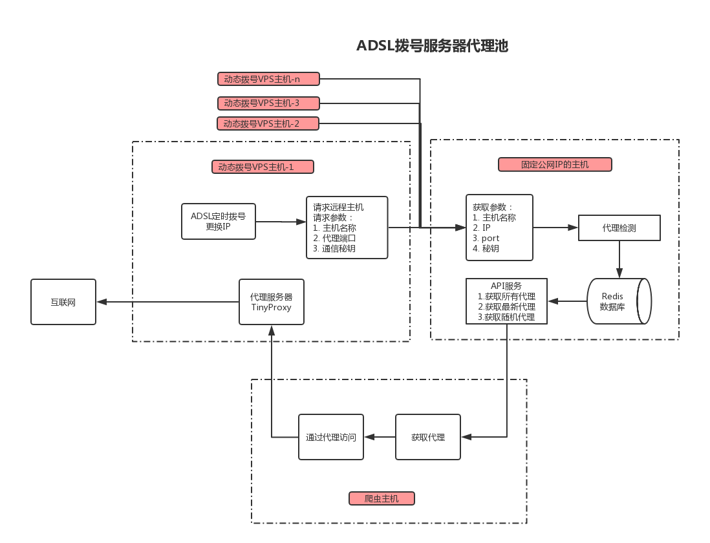

# ADSLProxy
基于ADSL拨号的VPS的代理IP服务

# 原理

1. 准备一个能ADSL拨号的VPS(Client)，并在上面搭建一个代理服务(squid/TinyProxy)。
2. 准备一个有固定IP的Server，并在上面搭建一个简单的web服务。
3. 在Client上定时拨号产生新的IP，并将新的IP传送到Server
4. 使用者请求Server获取最新的动态IP

# 使用

## Client
以root用户登陆VPS

修改`config`文件中的:`AUTH`,`IP` ；`init.sh`文件中的`htpasswd` ； `squid.conf`文件中的`http_port`

```bash
cd /root/
yum install -y epel-release
yum install -y git
git clone https://github.com/nghuyong/ADSLProxy.git
cd ADSLProxy
chmod +x init.sh
./init.sh
```


## Server
修改config文件中的:`AUTH`,`IP`
```bash
git clone https://github.com/nghuyong/ADSLProxy.git
pip install -r requirements.txt
nohup python server.py &
```

## API使用
```bash
Get http://IP:8080/api/proxy?auth=my_auth
```
```json
{
    "data": {
        "00155d0e02d7": {
            "time": "2018-11-15 20:50:07",
            "port": 8877,
            "ip": "125.121.112.244"
        }
    },
    "code": 0,
    "count": 1
}
```

# Reference
[Python爬虫进阶七之设置ADSL拨号服务器代理| 静觅](https://cuiqingcai.com/3443.html)